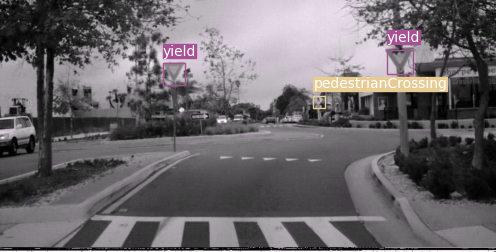

# PyTorch-YOLOv3 on GTSDB and LISA
A PyTorch implementation of YOLOv3, with support for training, inference and evaluation.
Pretrained on [LISA dataset](http://cvrr.ucsd.edu/LISA/lisa-traffic-sign-dataset.html) and [GTSDB dataset](https://benchmark.ini.rub.de/gtsdb_news.html).

## Installation
##### Clone repo, install requirements, and create virtual enviroment
    $ git clone https://github.com/chien-lung/PyTorch-YOLOv3.git
    $ cd PyTorch-YOLOv3/
    $ python3 -m venv yolo_venv
    $ source yolo_venv/bin/activate
    $ sudo pip install -r requirements.txt

##### Download pretrained weights (COCO, GTSDB, and LISA)
    $ cd weights
    $ bash download_weights.sh

<!-- ##### Download COCO
    $ cd data/
    $ bash get_coco_dataset.sh -->

##### Download GTSDB, GTSRB, and LISA
    $ cd datasets
    $ bash download_datasets.sh
    
<!-- ## Test
Evaluates the model on COCO test.

    $ python3 test.py --weights_path weights/yolov3.weights

| Model                   | mAP (min. 50 IoU) |
| ----------------------- |:-----------------:|
| YOLOv3 608 (paper)      | 57.9              |
| YOLOv3 608 (this impl.) | 57.3              |
| YOLOv3 416 (paper)      | 55.3              |
| YOLOv3 416 (this impl.) | 55.5              | -->

## Inference
Uses pretrained weights to make predictions on images. 

<!-- | Backbone                | GPU      | FPS      |
| ----------------------- |:--------:|:--------:|
| ResNet-101              | Titan X  | 53       |
| ResNet-152              | Titan X  | 37       |
| Darknet-53 (paper)      | Titan X  | 76       |
| Darknet-53 (this impl.) | 1080ti   | 74       | -->

    $ python detect.py --image_folder IMAGE_FOLDER
                        --model_def MODEL_CONFIG.cfg
                        --weights_path WEIGHT.pth
                        --class_path CLASS_DEFINITION.names
Example:

    $ python detect.py --image_folder data/samples
                        --model_def config/yolov3.cfg
                        --weights_path weights/yolov3.weights
                        --class_path data/coco.names

### COCO
<p align="center"></p>
<p align="center"></p>
<!-- <p align="center"></p> -->
<!-- <p align="center"></p> -->

### GTSDB
<p align="center"></p>
<p align="center"></p>

### LISA
<p align="center"></p>
<p align="center"></p>

## Train
```
$ train.py [-h] [--epochs EPOCHS] [--batch_size BATCH_SIZE]
                [--gradient_accumulations GRADIENT_ACCUMULATIONS]
                [--model_def MODEL_DEF] [--data_config DATA_CONFIG]
                [--pretrained_weights PRETRAINED_WEIGHTS] [--n_cpu N_CPU]
                [--img_size IMG_SIZE]
                [--checkpoint_interval CHECKPOINT_INTERVAL]
                [--evaluation_interval EVALUATION_INTERVAL]
                [--compute_map COMPUTE_MAP]
                [--multiscale_training MULTISCALE_TRAINING]
```

#### Example (COCO)
To train on COCO using a Darknet-53 backend pretrained on ImageNet run: 
```
$ python3 train.py --data_config config/coco.data  --pretrained_weights weights/darknet53.conv.74
```

#### Training log
```
---- [Epoch 7/100, Batch 7300/14658] ----
+------------+--------------+--------------+--------------+
| Metrics    | YOLO Layer 0 | YOLO Layer 1 | YOLO Layer 2 |
+------------+--------------+--------------+--------------+
| grid_size  | 16           | 32           | 64           |
| loss       | 1.554926     | 1.446884     | 1.427585     |
| x          | 0.028157     | 0.044483     | 0.051159     |
| y          | 0.040524     | 0.035687     | 0.046307     |
| w          | 0.078980     | 0.066310     | 0.027984     |
| h          | 0.133414     | 0.094540     | 0.037121     |
| conf       | 1.234448     | 1.165665     | 1.223495     |
| cls        | 0.039402     | 0.040198     | 0.041520     |
| cls_acc    | 44.44%       | 43.59%       | 32.50%       |
| recall50   | 0.361111     | 0.384615     | 0.300000     |
| recall75   | 0.222222     | 0.282051     | 0.300000     |
| precision  | 0.520000     | 0.300000     | 0.070175     |
| conf_obj   | 0.599058     | 0.622685     | 0.651472     |
| conf_noobj | 0.003778     | 0.004039     | 0.004044     |
+------------+--------------+--------------+--------------+
Total Loss 4.429395
---- ETA 0:35:48.821929
```

#### Tensorboard
Track training progress in Tensorboard:
* Initialize training
* Run the command below
* Go to http://localhost:6006/

```
$ tensorboard --logdir='logs' --port=6006
```

## Train on custom Dataset

### GTSDB
GTSDB dataset only contain 600 labeled images for training and 300 unlabeled images for testing.
Due to the limited number of images in GTSDB dataset, we integrate GTSRB when training.
Specifically, a random pasting algorithm is proposed here, as shown below.

<p align="center"></p>

    $ mv datasets/signs data/GTSDB # Running download_dataset.sh before executing this 

#### Train
To train on the GTSDB dataset run:

```
$ python train_GTSDB.py --model_def config/yolov3-GTSDB.cfg --data_config config/GTSDB.data 
```

Add `--pretrained_weights weights/darknet53.conv.74` to train using a backend pretrained on ImageNet.

Note: here we run `train_GTSDB.py` because the the loading image method is different, which including random pasting GTSRB data.

### Custom model
Run the commands below to create a custom model definition, replacing `NUM_CLASSES` with the number of classes in your dataset.

```
$ # Remind: DO NOT run this script multiple times.
$ cd config/                              # Navigate to config dir
$ bash create_custom_model.sh NUM_CLASSES # Create custom model 'yolov3-custom.cfg'
```

#### Train
To train on the custom dataset run:

```
$ python train.py --model_def config/yolov3-custom.cfg --data_config config/custom.data
```

Add `--pretrained_weights weights/darknet53.conv.74` to train using a backend pretrained on ImageNet.

### Training Set up
<!-- ├ ─ ┼ ┴ ┬ ┤ ┌ ┐ │ └ ┘ -->
Take `custom` as example, files should be modified:
```
data
 └─custom
    ├─classes.names
    ├─images
    ├─labels
    ├─train.txt
    └─valid.txt
config
 ├─custom.data
 └─yolov3-custom.cfg
```
#### Classes
Add class names to `data/custom/classes.names`. This file should have one row per class name.

#### Image Folder
Move the images of your dataset to `data/custom/images/`.

#### Annotation Folder
Move your annotations to `data/custom/labels/`.
The dataloader expects that the annotation file corresponding to the image `data/custom/images/train.jpg` has the path `data/custom/labels/train.txt`.
Each row in the annotation file should define one bounding box, using the syntax `label_idx x_center y_center width height`.
If the annotation file doesn't define, then it will consider no object in the image.
The coordinates should be scaled `[0, 1]`, and the `label_idx` should be zero-indexed and correspond to the row number of the class name in `data/custom/classes.names`.

#### Define Train and Validation Sets
In `data/custom/train.txt` and `data/custom/valid.txt`, add paths to images that will be used as train and validation data respectively.


## Credit

### YOLOv3: An Incremental Improvement
_Joseph Redmon, Ali Farhadi_ <br>

**Abstract** <br>
We present some updates to YOLO! We made a bunch
of little design changes to make it better. We also trained
this new network that’s pretty swell. It’s a little bigger than
last time but more accurate. It’s still fast though, don’t
worry. At 320 × 320 YOLOv3 runs in 22 ms at 28.2 mAP,
as accurate as SSD but three times faster. When we look
at the old .5 IOU mAP detection metric YOLOv3 is quite
good. It achieves 57.9 AP50 in 51 ms on a Titan X, compared
to 57.5 AP50 in 198 ms by RetinaNet, similar performance
but 3.8× faster. As always, all the code is online at
https://pjreddie.com/yolo/.

[[Paper]](https://pjreddie.com/media/files/papers/YOLOv3.pdf) [[Project Webpage]](https://pjreddie.com/darknet/yolo/) [[Authors' Implementation]](https://github.com/pjreddie/darknet)

```
@article{yolov3,
  title={YOLOv3: An Incremental Improvement},
  author={Redmon, Joseph and Farhadi, Ali},
  journal = {arXiv},
  year={2018}
}
```
